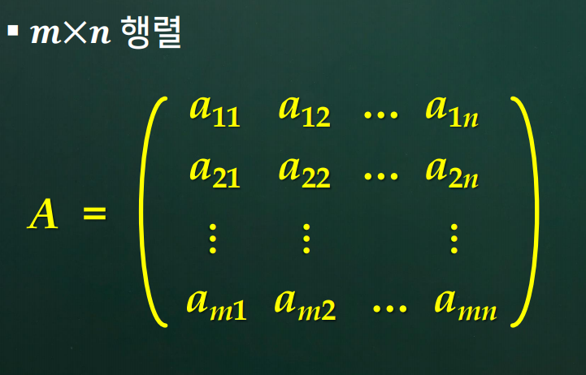
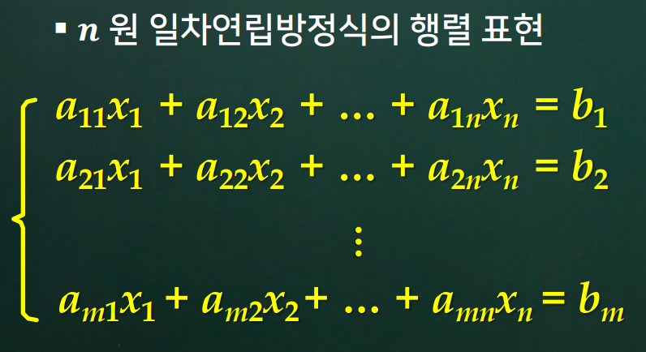
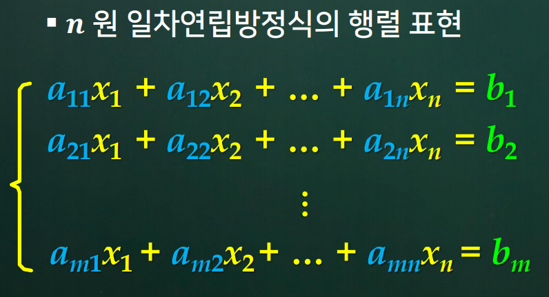
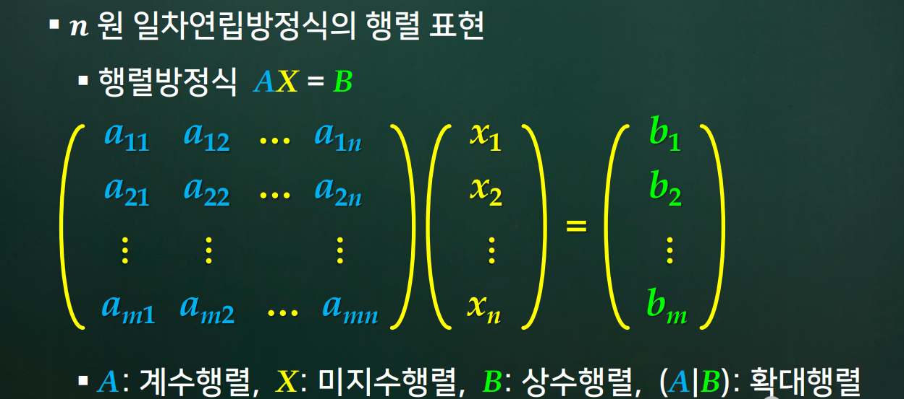
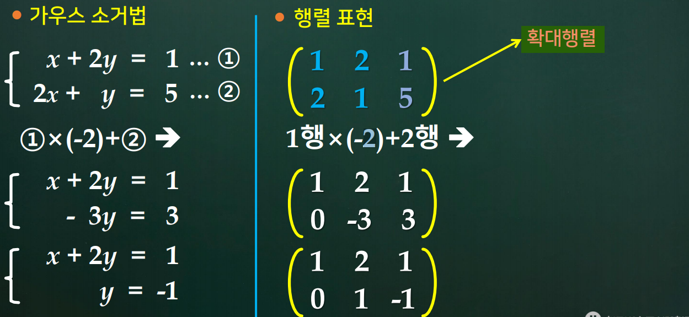

# 2강. 행렬과 가우스 소거법

## 학습 내용

1. 행렬과 일차연립방정식
2. 기본행연산
3. 가우스 소거법
4. 가우스-조르단 소거법

## 학습 목표

- `행렬`과 그에 관련된 `용어`들을 설명할 수 있다.
- `일차연립방정식을 행렬`로 나타낼 수 있다.
- `기본행연산`과 그 표기법을 설명할 수 있다.
- 주어진 행렬을 `행제형 행렬` 및 `소거행제형 행렬`로 변환할 수 있다.
- `가우스 소거법`, `가우스-조르단 소거밥`으로 일차연립방정식의 해를 구할 수 있다.

## 주요 용어

- 행렬
- 계수행렬, 상수행렬, 확대행렬
- 기본행연산
- 행제형행렬
- 소거행제형행렬
- 가우스 소거법
- 가우스-조르단 소거법

# - 시작 -

## 1. 행렬

### 1. 행렬(matrix)

- 행(row)과 열(column)로 구성되는 사각형 형태로 수를 배열한 것

- 행렬의 원소 (성분; element)

- 행렬의 크기

  - 행의 개수 X 열의 개수

    

  - aij : 행렬 A의 `원소[성분]`(element)

  - 2 x 3 - 행이 2개 열이 3개

  - 4 x 2 - 행이 4개 열이 2개

  - 3 x 3 - 행이 3개 열이 3개 (정사각형 모양을 띈다해서 `정방행렬`이라고 부름)

### 2. 일차연립방정식의 행렬 표현

- 일차방정식의 행렬 표현

  

- 계수와 상수를 표현하는 그림

  

- 계수 행렬, 미지수 행렬, 상수 행렬의 표현

  

  - `행렬방정식 AX = B`
  - 확대 행렬 - 1차 연립방정식을 표현하는데 있어 an 부터 bn으로 알고있는 것

### 3. 가우스 소거법의 행렬 표현

- 가우스 소거법의 행렬 표현

  

  - `기본 행 연산 3가지`
  - `방정식은 확대 행렬과 1:1대응이다`
  - `가우스 소거법에서 사용했던 방정식의 기본 연산 3가지는 행렬표현에서 기본 행연산의 3가지로 나타낸다.`

## 2. 기본 행연산

### 1. 기본행연산

- 기본행연산(elementary row operation)
  - `방정식에 관한 3가지 기본 연산`
    1. 두 방정식을 서로 교환한다.
    2. 한 방정식에 0이 아닌 상수를 곱한다
    3. 한 방정식에 임의의 상수를 곱하여 다른 방정식에 더한다.
  - 확대행렬에 관한 3가지 기본 연산
    - 두 행을 서로 교환한다.
    - 한 행에 0이 아닌 상수를 곱한다.
    - 한 행에 임의의 상수를 곱하여 다른 행에 더한다.
  - 확대행렬에 관한 3가지 기본연산에 대한 정의
    - 정의 2.1
      - (1) Ri,j - i번쨰 행을 j행과 위치를 바꿔주는 것
      - (2) Ri (c) (단, c != 0) - i 번쨰 행에 c를 곱해주는 것 (단, 0은 제외)
      - (3) Ri,j (c) - i번쨰 행에 c를 곱해서 j행과 더해주는 것

### 2. 행렬을 이용한 일차연립방정식

- 정의 2.2
  - 행렬 A에 일련의 `기본행연산`을 적용하여 행렬 B를 얻을 수 있는 경우

  - A와 B는 `행상등(row-equivalent)하다`고 말한다.

  - A -> A1 -> A2 -> .... -> B

    

    

    - x + 0y + 0z = ■
    - 0x + y + 0z = ★
    - 0x + 0y + z = ▲
    - 정리 2.1
      - 일차연립방정식 L1과 L2에 대해서 각각의 확대행렬을 A와 B라 하였을 때
        A와 B가 `행상등`하면 L1과 L2는 `상등(해집합이 서로 같다)`하다.

### 3. 행제형 행렬 (행제 - 사다리, 형 - 꼴)

- 정의 2.3 `행제형 행렬`의 조건
  1. 영행이 있다면 그것은 `영행이 아닌 행의 아래에` 있다.
     - 결국 영행은 가장 아래에 있어야 한다. (하지만 영행아래 영행이 또 존재한다면 모르겠다.)
  2. 영행이 아닌 행의 첫번째 0이 아닌 원소를 행의 `선도원소`라고 할 때 `모든 선도원소는 1`이다.
  3. 영행이 아닌 연속된 두 행이 있어 각각 i번째 행과 i+1번쨰 행이라 할 때
     - `i 번째 행의 선도 원소는 i+1번쨰 행의 선도원소보다 왼쪽에` 있다( i >= 1)
     - 사다리꼴 모습이어야 한다

- 정의 2.4 소거행제형 행렬의 조건
  - `행제형 행렬`이면서
    4. i 번째 행의 선도원소가 j번쨰 열에 있다면
       `j번쨰 열의 다른 모든 원소는 0`이다.

## 3. 가우스 소거법

### 1. 가우스 소거법

- `알고리즘 2.1` AX = B를 푸는 `가우스 소거법`
  - 일차연립방정식 AX = B를푸는 `가우스 소거법`의 절차는 다음과 같다.
    - 단계 1. 행렬 A와 B로 부터 확대행렬 C = (A | B)를 구성한다.
    - 단계 2. 기본행연산을 이용하여 C를 `행제형`으로 변환한다.
    - 단계 3. `후진대입법`을 이용하여 해를 구한다.

###  2. 선도변수와 자유변수

- 알고리즘 2.1의 단계 2에서 얻은 행제형 행렬에서
  선도원소가 속한 열에 대응되는 미지수를 `선도변수(leading variable)`라 부르고
  그 밖의 미지수들은 `자유변수(free variable)`라 부른다.

## 4. 가우스-조르단 소거법

- 알고리즘 2.3 AX = B를 푸는 `가우스-조르단 소거법`의 절차는 다음과 같다.
  - 단계 1. 행렬 A와 B로 부터 확대행렬 C = (A | B)를 구성한다.
  - 단계 2. 기본행연산을 이용하여 C를 `소거행제형` D로 변환한다.
  - 단계 3. `자유변수` 각각을 임의의 매개변수로 둔다.
  - 단계 4. 행렬 d의 영행이 아닌 각 행을 `선도변수`에 관하여 푼다.

- 가우스 소거법과 `가우스-조르단 소거법`의 비교
  - 가우스 소거법
    - `행제형 행렬`을 구한 다음 `후진대입법` 을 사용
  - 가우스-조르단 소거법
    - `소거행제형 행렬`을 구하여 바로 해를 구함

---

# 학습내용 정리하기

## 1. 행렬과 일차연립방정식

1. 행렬
   - 행과 열로 구성되는 사각형 형태로 수를 배열
   - 행렬의 원소
   - 행렬의 크기 : 행 X 열
2. 일차 연립방정식의 행렬 표현
   - 계수 행렬, 상수 행렬, 확대 행렬
   - AX = B (행렬 방정식)
3. 가우스 소거법의 행렬 표현

## 2. 기본 행연산

1. 기본 행연산
   - (1) Ri,j - i번쨰 행을 j행과 위치를 바꿔주는 것
   - (2) Ri (c) (단, c != 0) - i 번쨰 행에 c를 곱해주는 것 (단, 0은 제외)
   - (3) Ri,j (c) - i번쨰 행에 c를 곱해서 j행과 더해주는 것
   - 행상등
2. 행렬을 이용한 일차연립방정식 해법
   - 일차연립방정식의 상등
3. 행제형 행렬
   - 행제형 행렬
   - 소거행제형 행렬

## 3. 가우스 소거법

1. 가우스 소거법 (알고리즘 2.1)
   1. AX = B를 푸는 가우스 소거법의 절차
      1. 단계 1. 행렬 A와 B로 부터 `확대행렬` C = (A | B)를 구성한다.
      2. 단계 2. 기본행연산을 이용하여 C를 `행제형`으로 변환한다.
      3. 단계 3. `후진대입법`을 이용하여 해를 구한다.
2. 가우스-조르단 소거법 (알고리즘 2.3)
   - AX = B를 푸는 `가우스-조르단 소거법`의 절차는 다음과 같다.
     - 단계 1. 행렬 A와 B로 부터 확대행렬 C = (A | B)를 구성한다.
     - 단계 2. 기본행연산을 이용하여 C를 `소거행제형` D로 변환한다.
     - 단계 3. `자유변수` 각각을 임의의 매개변수로 둔다.
     - 단계 4. 행렬 d의 영행이 아닌 각 행을 `선도변수`에 관하여 푼다.

