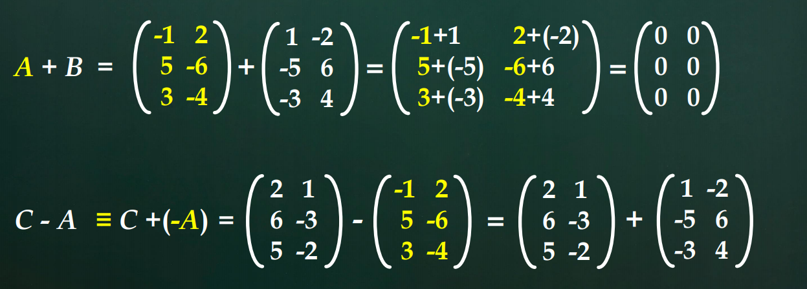
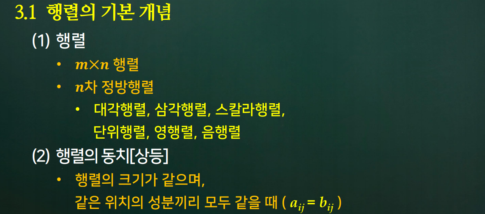

# 3강. 행렬 연산

### 들어가기

- 행렬 : 새로운 어휘

  

  - 1 x 3은 행벡터
  - 2 x 1은 열벡터
  - 1 x 1은 실수와 같다.

- 추상화

  

  

  

  

## 학습내용

1. 행렬의 기본 개념
2. 행렬의 합
3. 행렬의 스칼라곱
4. 행렬의 곱
5. 행렬의 전치

## 학습목표

- 행렬끼리의 합 연산을 설명할 수 있다.
- 행렬과 스칼라의 곱연산을 설명할 수 있다.
- 행렬끼리의 곱 연산을 설명할 수 있다.
- 하나의 행렬에 대한 전치 연산을 설명할 수 있다.

## 3.1 행렬의 기본개념

- 정의 3.1 

  - m x n 행렬 A에 대하여
    1. i 번쨰 행의 j번쨰 원소 => (i, j)원소[성분] aij
    2. 행렬 A의 표현 => A = (aij) (1 <= i <= m, 1 <= j <= n)
    3. m = n 일때 => A는 `n차 정방행렬`(square matrix of order n)
    4. A가 정방행렬일 때 => aii(1 <= i <= n)를 A의 `주대각원소`[성분]

- 예제 : 다음 행렬에 대해 설명하시오.

  

  - A의 전치연산은 B가 된다.
  - C는 2차 정방행렬
  - D는 3차 정방행렬
  - E는 4차 정방행렬, 대각행렬, 4차 단위행렬
  - F는 3 x 1행렬 열벡타
  - G는 1 x 3행렬 행벡타
  - H는 1 x 1행렬 즉, 실수와 같다.

- 정의 3.2

  - n차 정방행렬 A = (aij)에 대하여
    1. aij = 0 (단, i != j) => 대각행렬(diagonal matrix)
       1. aii = c (1 <= i <= n) => 스칼라 행렬(scalar matrix)
       2. aii = 1 (1 <= i <= n) => 단위 행렬(identity matrix)
    2. aij = 0 (단, i < j)
       1. 하삼각 행렬(lower triangular matrix)
    3. aij = 0 (단, i > j)
       1. 상삼각 행렬(upper trangular matrix)

- 정의 3.3

  - 행렬의 상등
    - A = (aij)와 B = (bij)를 m x n 행렬이라 할 때, 모든 i, j (1 <= i <= m), (1 <= j <= n)에 대해 
      aij = bij 인 경우
      A와 B는 서로 같다 또는 상등하다고 말한다.

## 3.2 행렬의 합

- 정의 3.4

  - 행렬의 합
    - A = (aij)와 B = (bij)를  `m x n 행렬`이라 하면 A와 B의 합(sum)은 m x n행렬 C = (cij)로서
      cij = aij + bij (1 <= i <= m, 1 <= j <= n) 으로 정의 된다. 
      이런경우 A + B = C로 표시한다.

- 정리 3.1 

  - 행렬의 합의 성질
    - Mmn을 m x n 행렬 전체의 집합이고, A, B, C ∈ Mmn일 때 다음이 성립한다.
      1. A + B = B + A
      2. A + (B + C) = (A + B) + C
      3. A + O = A를 만족하는 유일한 행렬 O가 Mmm에 존재함
         - 행렬 O : m x n크기의 영행렬(zero matrix)
      4. A + D = O을 만족하는 행렬 D가 A에 대해 유일하게 Mmm에 존재함
         - 행렬 D : -A라 표기하며 A의 음행렬(negative matrix)

- 예제 : 다음 행렬 연산을 수행하시오. [합과 차]

  

  

## 3.3 행렬의 스칼라 곱

- [참고] 백터의 스칼라곱

  

- 정의 3.5

  - 행렬의 스칼라 배

    

- 정리 3.2

  - 행렬의 스칼라 배의 성질
    - A, B, C ∈ Mmn, c, d를 임의의 수
      1. (c + d)A = cA + dA
      2. c(A + B) = cA + cB
      3. c(dA) = (cd)A
      4. 1A = A

## 3.4 행렬의 곱

- 정의 3.6

  - 행렬의 곱

    

- 벡터의 내적

  

- 행렬의 곱

  

- 유의 사항

  - 행렬 곱의 특이사항
    - m x p 행렬 A와 p x n 행렬 B에 대해 AB는 정의되지만 BA는 다음 4가지 경우가 있음
      1. BA가 정의되지 않는 경우 (n != m)
      2. BA가 정의되나, AB와 크기가 같지 않는 경우 (n = m, p != n)
         - 즉, AB는 n x n행렬, BA는 p x p 행렬이다.
      3. BA가 정의되고 AB와 크기도 같지만 AB != BA인 경우
      4. BA가 정의되고 AB와 크기도 같으며 AB = BA인 경우
    - 행렬의 곱은 교환법칙이 성립하지 않는다.

- 정리 3.3

  - 행렬의 곱의 성질
    - 행렬 A, B, C와 임의의 수 c에 대해 행렬의 곱이 정의되는 경우, 다음이 성립한다.
      1. A(B + C) = AB + AC
      2. (A + B)C = AC + BC
      3. A(BC) = (AB)C
      4. A(cB) = c(AB) = (cA)B

- 유의 사항

  - 행렬 곱의 항등원

    - 행렬의 곱에도 항등원이 있는가?
      - 임의의 수 a에 대해 1a = a1 = a를 만족하는 수 1과 유사한 기능을 갖는 행렬
      - 행렬의 곱에서 AI = IA = A를만족하는 행렬 I
        - `단위행렬`(정의 3.2)
      - 만일 A = (aij)가 m x n 행렬이라면 AIn = A, ImA = A 가 된다.
        - 즉, 단위행렬은 행렬의 곱에 대한 항등원 이다.

  - 행렬의 거듭 제곱

    

  

  

## 3.5 행렬의 전치

- 정의 3.7

  - 행렬의 전치

    

- 정리 3.5

  - 행렬 전치의 성질

    

- 정의 

  - 대칭행렬

    

- 예제 : 전치연산

  

- 예제 : 대칭행렬

  

  

## 학습내용 정리하기

