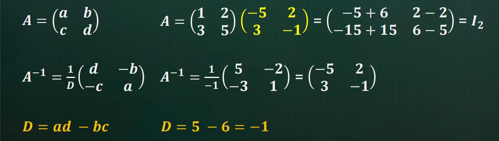
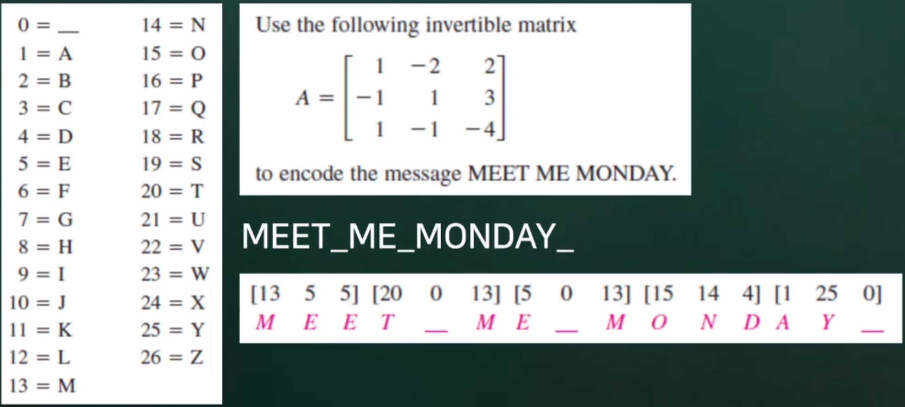
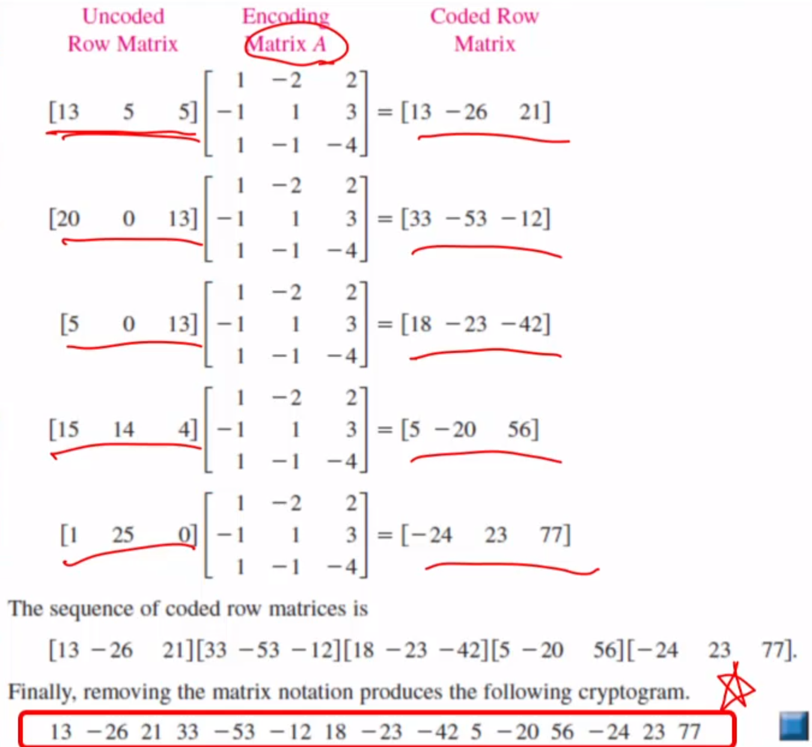
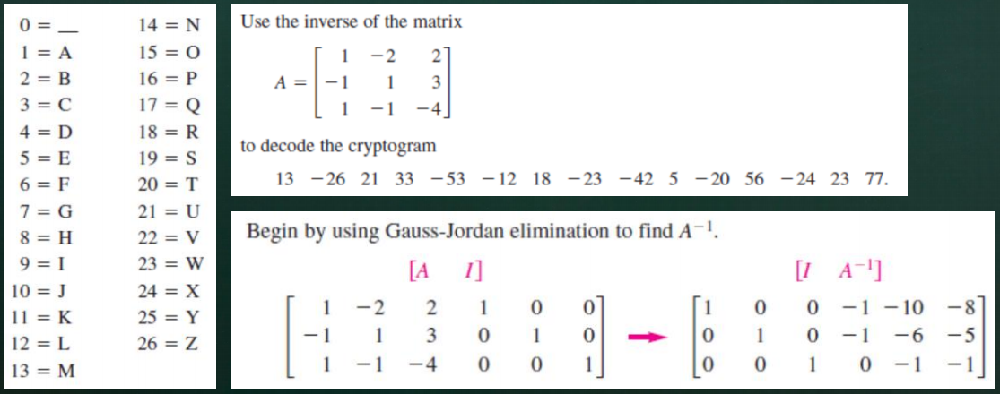
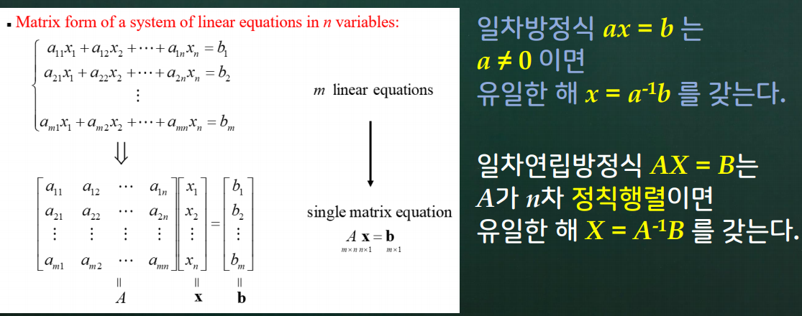
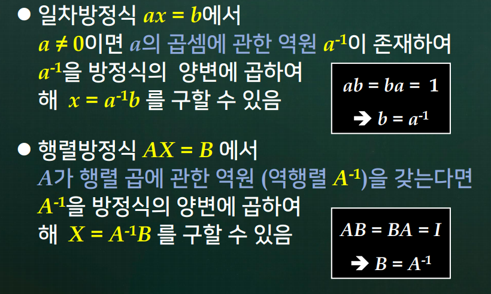

# 4강. 역행렬

### 역행렬

- 2 x 2 행렬 A의 역행렬 구하는 공식

  

### 역행렬 응용 : 암호문 만들기

### 역행렬 응용 : 암호문 해독하기

### 추상화 (抽象化 : abstraction)

## 학습 내용

1. 정칙행렬과 역행렬
2. 역행렬 구하는 방법
3. 일차연립방정식과 역행렬

## 학습 목표

- 정칙행렬과 역행렬이 무엇인지 설명할 수 있다.
- 주어진 행렬 A의 역행렬 A-1을 구할 수 있다.
- 일차연립방정식의 해법과 역행렬과의 관련성을 설명할 수 있다.
- 정칙행렬의 성질을 5가지 정도 열거할 수 있다.

## 4.1 정칙행렬과 역행렬

### 배경

