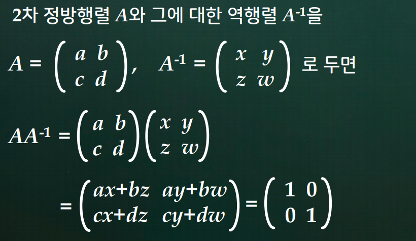

# 4강. 역행렬

### 역행렬

- 2 x 2 행렬 A의 역행렬 구하는 공식

  

### 역행렬 응용 : 암호문 만들기

### 역행렬 응용 : 암호문 해독하기

### 추상화 (抽象化 : abstraction)

## 학습 내용

1. 정칙행렬과 역행렬
2. 역행렬 구하는 방법
3. 일차연립방정식과 역행렬

## 학습 목표

- 정칙행렬과 역행렬이 무엇인지 설명할 수 있다.
- 주어진 행렬 A의 역행렬 A-1을 구할 수 있다.
- 일차연립방정식의 해법과 역행렬과의 관련성을 설명할 수 있다.
- 정칙행렬의 성질을 5가지 정도 열거할 수 있다.

## 4.1 정칙행렬과 역행렬

### 배경

### 정리 4.1 정칙행렬, 역행렬

### 정리 4.1 정칙행렬의 유일성

- A가 정칙행렬이면 A-1은 유일하다.

### 예제 4.2 2차 정방행렬의 역행렬 구하는 공식

### 행렬의 거듭 제곱

### 정리 4.2 정칙행렬의 성질

## 4.2 역행렬 구하는 방법

### 정의 4.2 기본행렬

### 예제 4.5 기본행렬과 기능

### 정리 4.3 기본행연산과 기본행렬의 관계

### 정리 4.4 기본행렬의 성질

### 성질 정칙행렬과 영행 [영렬]

### 정리 4.5 정칙행렬의 특성

### 정리 4.6 역행렬 구하는 이론

## 4.3 일차연립방정식과 역행렬

### 정의 4.3 위수

### 정리 4.7 일차연립방정식의 해

### 정칙행렬과 일차연립방정식

### 정리 4.8 행렬방정식의 AX = B의 해

## 정리 4.9 동차연립방정식

### 정리 4.10 정칙행렬의 특성 정리

## 마무리 : 1. 학습내용 정리하기

