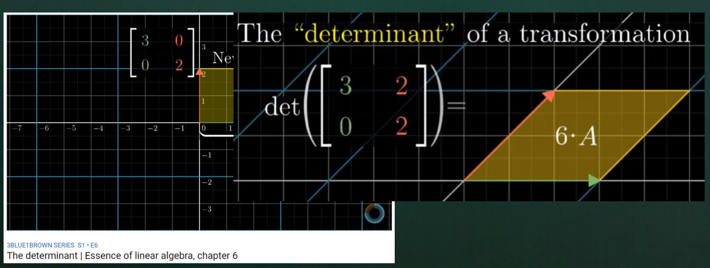
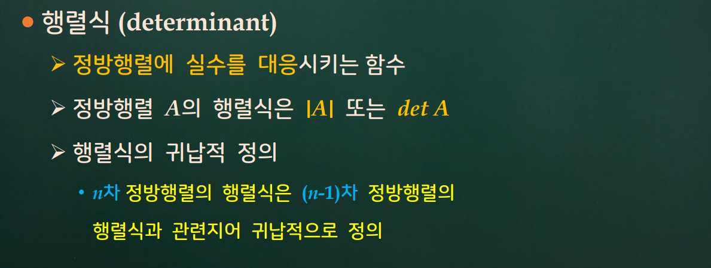
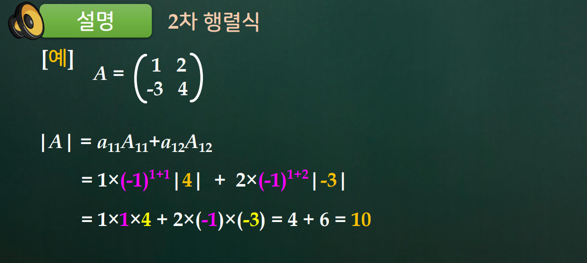

# 5강. 행렬식

## 들어가기

https://www.youtube.com/watch?v=Ip3X9LOh2dk

## 학습 내용

- 5.1 행렬식
- 5.2 행렬식의 성질
- 5.3 행렬연산과 행렬식

## 학습 목표

- 행렬식의 정의와 의미를 설명할 수 있다.
- 행렬식의 기본 성질을 설명할 수 있다.
  - [특히 기본행연산과 행렬식의 관련성]
- 행렬 연산과 행렬식의 관련성을 설명할 수 있다.
- 정방행렬이 정칙행렬이 되기 위한 행렬식 특성을 설명할 수 있다.

## 5.1 행렬식

### 행렬식의 성질

### 행렬 연산과 행렬식

